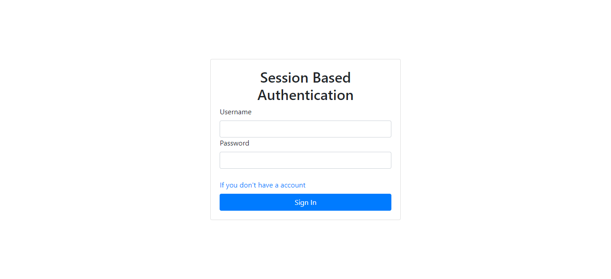

# Session-Based Authentication

This project was created based on my knowledge and understanding. The purpose is to develop myself. If there are suggestions or mistakes. Please don't hesitate to text me. Thank you for watching 🙏

## Table of contents

- [Overview](#overview)
  - [The challenge](#the-challenge)
  - [Screenshot](#screenshot)
  - [Links](#links)
- [My process](#my-process)
  - [Built with](#built-with)
  - [What I learned](#what-i-learned)
  - [Useful resources](#useful-resources)
- [Author](#author)

## Overview

### The challenge

Users should be able to:

- Register in the project
- Use Authentication system (login and logout)
- Delete your account

### Screenshot

### Links

- Live Site URL: In Process

## My process

### Built with

- ejs
- express
- express-session
- mysql2
- sequelize

### What I learned

- Use ejs work with express
- Build and config your server with express
- Manage the database with sequelize and mysql2
- Manage session with express-session

### Useful resources

- [ ejs ](https://shorturl.at/grtDU) - How To Use EJS to Template Your Node Application
- [ express ](https://expressjs.com/en/starter/hello-world.html) - Express Documentation
- [ Sequelize ](https://shorturl.at/dwEN6) - The Ultimate Guide To Get Started With Sequelize ORM
- [ express-session ](https://kokdev.com/memory/nodejs-session-cookie/) - การจัดการ Session Node.js ด้วย Express Session

## Author

- Github - [Tum](https://github.com/Tam643/Session-Based-Authentication)
